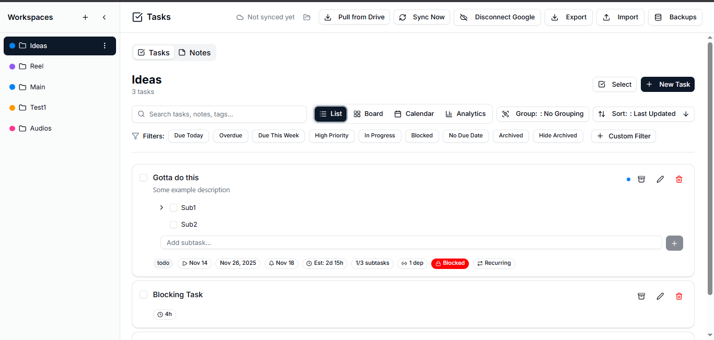
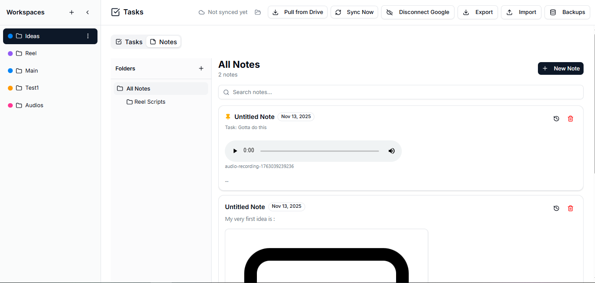
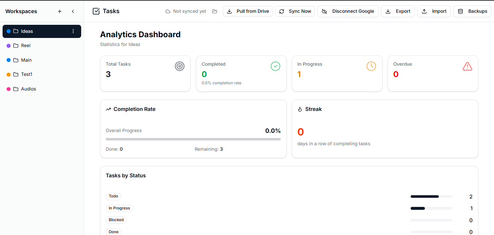

# Tasks - TODO App

A powerful task management application with notes, folders, and Google Drive sync.

## Live Demo

Visit: [https://yourusername.github.io/tasks/](https://yourusername.github.io/tasks/)

## Highlights

- **Workspaces & Tasks** – subtasks, priorities, tags, dependencies, inline note linking.
- **Notes & Media** – Markdown editor/viewer, folders, inline images, audio recorder, unified `media:` references.
- **Backups & Sync** – Google Drive integration via OAuth 2.0 PKCE (no client secret required).
- **Performance UX** – virtualized lists, skeleton loaders, optimistic updates, toasts.
- **Accessibility & Mobility** – focus management, keyboard shortcuts, command palette, responsive sheet/sidebar layouts.

## UI Previews

| Main View | Board View |
| --- | --- |
|  |  |

| Notes View | Analytics |
| --- | --- |
|  |  |

Each view is responsive, keyboard-accessible, and designed to keep tasks and notes side by side. The board view reorders tasks via drag-and-drop, the notes module provides full markdown previews, and analytics summarize workspace activity.

## Development

```bash
npm install
npm run dev
npm run build
npm run build:gh-pages
```

## Deployment

See [GITHUB_PAGES_SETUP.md](./GITHUB_PAGES_SETUP.md) for deployment instructions.

## Google Sync Setup

See [GOOGLE_SYNC_SETUP.md](./GOOGLE_SYNC_SETUP.md) for the end-to-end Google sync overview.

For a hands-on local setup (including OAuth configuration and environment variables) follow [docs/LOCAL_DRIVE_BACKUP_SETUP.md](./docs/LOCAL_DRIVE_BACKUP_SETUP.md).

## License

Private project
